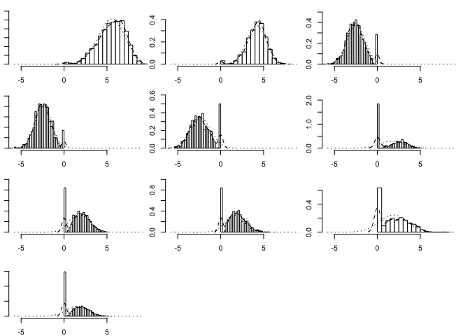

# BayesCOOP - Bayesian Cooperative Learning for Multimodal Integration

The repository houses the **`BayesCOOP`** R package for multimodal
integration for prediction of continuous outcomes.

## Dependencies

`BayesCOOP` requires the following `R` package: `devtools` (for
installation only). Please install it before installing `BayesCOOP`,
which can be done as follows (execute from within a fresh R session):

    install.packages("devtools")
    library(devtools)

## Installation

Once the dependencies are installed, `BayesCOOP` can be loaded using the
following command:

    devtools::install_github("himelmallick/BayesCOOP", quiet = TRUE)
    library(BayesCOOP)

## Example Implementation

### Loading the StelzerDOS real dataset

    data_train = get(load(url("https://raw.githubusercontent.com/himelmallick/IntegratedLearner/master/data/StelzerDOS.RData"))); rm(pcl)
    data_test = get(load(url("https://raw.githubusercontent.com/himelmallick/IntegratedLearner/master/data/StelzerDOS_valid.RData"))); rm(pcl)

### Pre-processing the longitudinal data by considering only baseline observations

#### Remove metabolomics from the train set to match with validation

    if (!requireNamespace("dplyr", quietly = TRUE)) {
      install.packages("dplyr", repos = "https://cloud.r-project.org")
    }
    library(dplyr)

    data_train$feature_metadata = data_train$feature_metadata %>% dplyr::filter(featureType!='Metabolomics')
    data_train$feature_table = data_train$feature_table[rownames(data_train$feature_metadata),]

#### Consider only baseline observations for the train set

    positions = grep("A", colnames(data_train$feature_table), ignore.case = TRUE)
    data_train$feature_table = data_train$feature_table[, positions]
    data_train$sample_metadata = data_train$sample_metadata[positions, ]
    rm(positions)

#### Consider only baseline observations for the validation set

    positions = grep("G1", colnames(data_test$feature_table))
    data_test$feature_table = data_test$feature_table[, positions]
    data_test$sample_metadata = data_test$sample_metadata[positions, ]
    rm(positions)

    set.seed(1)
    result = BayesCOOP::bayesCoop(data_train, data_test, family = "gaussian", 
                          ss = c(0.05, 1), group = TRUE,
                          bb = TRUE, alpha_dirich = 1, 
                          bbiters = 1100, bbburn = 100, maxit = 100,
                          filter = TRUE, abd_thresh = 0, prev_thresh = 0.1,
                          Warning = TRUE, verbose = TRUE, control = list())

    print(result$mspe)
    ## [1] 501.0142
    print(result$time)
    ## [1] 3.217

    top_indices <- order(abs(result$beta_postmed), decreasing = TRUE)[1:10]
    top_values <- result$beta_postmed[top_indices]
    if (!requireNamespace("psych", quietly = TRUE)) {
      install.packages("psych", repos = "https://cloud.r-project.org")
    }
    library(psych)
    multi.hist(result$beta_samples[,top_indices],density=TRUE,main="")

